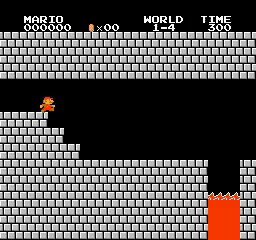
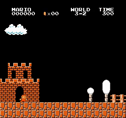
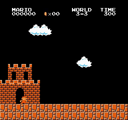
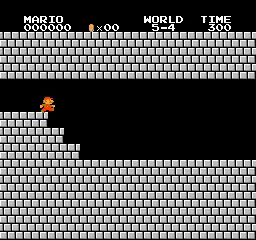

# Mario_A2C_A3C
Playing Super Mario Bros with Advantage Actor Critic (A2C) and Asynchronous Advantage Actor Critic (A3C)

## Introduction

My PyTorch Advantage Actor Critic (A2C) and Asynchronous Advantage Actor Critic (A3C) implement to playing Super Mario Bros.

This is A2C result:

  
  
  
   
  
  
  
   
  
  
  
   
  
  
  
   
  
  
  
   
  
  
  
   
  
  
  
   
  
  
  
   
  <i>A2C Results</i>

## Motivation

I've been interested in Reinforcement Learning since I was in university, but I only tested Atari games with the recommended hyperparameters. If you've ever studied RL, you'll realize that finding the right hyperparameters is extremely important for most RL algorithms (because RL is often very sensitive to hyperparameters). Now I want to try using RL to train the agent to play another game instead of Atari like in the papers.

Initially, I only intended to use the stable baseline to train the agent with some lines of code. But I realized that the documentation and code were very hard to read and it was difficult for me to adjust the code.

I have reviewed many other source codes to train agents to play Mario, but most of them only code demos and complete a few very easy states like 1-1, 1-4 and sometimes have some bugs in the code. They also often use simple or right only action_space to make the agent learning easier. So I decided to implement A2C so I can easily adjust the code and understand the algorithm more deeply. I tried tuning the hyperparameters to solve as many stages as possible with this source code.

## How to use it

### A2C

You can use my notebook for training and testing agent very easy:
* **Train your model** by running all cell before session test
* **Test your trained model** by running all cell except agent.train(), just pass your model path to agent.load_model(model_path)

Or you can use **A2C/train.py** and **A2C/test.py** if you don't want to use notebook:
* **Train your model** by running **A2C/train.py**: For example training for stage 1-4: python train.py --world 1 --stage 4 --num_envs 8
* **Test your trained model** by running **A2C/test.py**: For example testing for stage 1-4: python test.py --world 1 --stage 4 --pretrained_model best_model.pth  --num_envs 2

### A3C

Use **A3C/train.py** and **A3C/test.py**:
* **Train your model** by running **A3C/train.py**: For example training for stage 1-4: python train.py --world 1 --stage 4 --num_envs 8
* **Test your trained model** by running **A3C/test.py**: For example testing for stage 1-4: python test.py --world 1 --stage 4 --pretrained_model best_model.pth  --num_envs 2

A3C use multi process make it hard to work with notebook --> I don't use notebook for A3C version!

## Trained models

You can find A2C trained model in folder [trained_model](A2C\trained_model)

## Hyperparameters

### A2C

I use hyperparameters as this table to train agent. How I find hyperparameters:
* First, I find default hyperparameters from other implements and Atari hyperparameters like: learning rate is 1e-4, gamma is 0.9, learn_step is 20 and num_envs is 16 (for stages 7-1, 7-2, 7-3, I just use num_envs is 8 because I don't have enought resource, set num_envs to 16 still better for this stages).
* Try default hyperparameters.
* Tune hyperparameters if agent failed. I found that only gamma and learn_step help agent learn better.
* Changing the learning rate does not improve the agent and we cannot find the optimal learning rate except by trial and error (consuming a lot of resources).
* For some stages that require a long sequence of actions (like jumping over a deep hole), setting a gamma of 0.99 helps the model complete the stage while 0.9 cannot.
* Setting learn_step to 5 usually helps the model learn better (especially helps complete stage 8-1) but training time and stability will decrease compared to learn_step of 20.

| World | Stage | num_envs | learn_step | gamma | learning_rate | training_step | training_time   |
|-------|-------|----------|------------|-------|---------------|---------------|-----------------| 
| 1     | 1     | 16       | 20         | 0.9   | 1e-4          | 374000        | 5:34:38         |
| 1     | 2     | 16       | 20         | 0.9   | 1e-4          | 1388000       | 18:44:51        |
| 1     | 4     | 16       | 20         | 0.9   | 1e-4          | 56000         | 0:51:34         |
| 2     | 1     | 16       | 20         | 0.99  | 1e-4          | 2520000       | 15:11:00        |
| 2     | 2     | 16       | 20         | 0.9   | 1e-4          | 2582000       | 1 day, 14:54:56 | 
| 2     | 3     | 16       | 20         | 0.9   | 1e-4          | 401000        | 5:28:46         |
| 2     | 4     | 16       | 20         | 0.9   | 1e-4          | 247000        | 3:40:49         |
| 3     | 1     | 16       | 20         | 0.9   | 1e-4          | 308000        | 4:43:37         |
| 3     | 2     | 16       | 20         | 0.9   | 1e-4          | 156000        | 2:29:00         |
| 3     | 3     | 16       | 20         | 0.99  | 1e-4          | 1311000       | 15:16:28        |
| 3     | 4     | 16       | 20         | 0.99  | 1e-4          | 443000        | 6:46:07         |
| 4     | 1     | 16       | 20         | 0.9   | 1e-4          | 295000        | 4:08:22         |
| 4     | 2     | 16       | 20         | 0.99  | 1e-4          | 1120000       | 11:35:43        |
| 5     | 1     | 16       | 20         | 0.9   | 1e-4          | 486000        | 7:10:43         |
| 5     | 2     | 16       | 20         | 0.9   | 1e-4          | 1089000       | 11:50:50        |
| 5     | 4     | 16       | 20         | 0.99  | 1e-4          | 1636000       | 22:02:11        |
| 6     | 1     | 16       | 20         | 0.9   | 1e-4          | 88000         | 1:01:50         |
| 6     | 2     | 16       | 20         | 0.99  | 1e-4          | 1215000       | 16:41:19        |
| 6     | 4     | 16       | 20         | 0.99  | 1e-4          | 940000        | 7:57:47         |
| 7     | 1     | 8        | 20         | 0.9   | 1e-4          | 528000        | 4:06:45         |
| 7     | 2     | 8        | 20         | 0.9   | 1e-4          | 3427000       | 1 day, 5:22:18  |
| 7     | 3     | 8        | 20         | 0.9   | 1e-4          | 1545000       | 12:17:16        |
| 7     | 4     | 16       | 20         | 0.99  | 1e-4          | 1462000       | 15:27:19        |
| 8     | 1     | 16       | 5          | 0.9   | 1e-4          | 2158000       | 1 day, 2:35:41  |
| 8     | 2     | 16       | 20         | 0.9   | 1e-4          | 1107000       | 16:24:30        |
| 8     | 3     | 16       | 20         | 0.9   | 1e-4          | 521000        | 8:12:27         |

## Questions

* Is this code guaranteed to complete the stages if you try training?
  
This hyperparameter does not guarantee you will complete the stage, but I tried and most stages will complete on the first train. A few difficult stages will take 2 to 3 times to complete.

* How long do you train agents?
  
Within a few hours to more than 1 day. Time depends on hardware, I use many different hardware so time will not be accurate.

* How can you improve this code?
  
You can separate the test agent part into a separate thread or process. I'm not good at multi-threaded programming so I don't do this.

## Requirements

* **python 3>3.6**
* **gym==0.25.2**
* **gym-super-mario-bros==7.4.0**
* **imageio**
* **imageio-ffmpeg**
* **cv2**
* **pytorch** 
* **numpy**

## Acknowledgements
With my A2C code, I can completed 26/32 stages of Super Mario Bros. With harder stages like 1-3, 5-3, ... A2C can not completed this stages.

## Reference
* [uvipen A3C](https://github.com/uvipen/Super-mario-bros-A3C-pytorch)
* [uvipen PPO](https://github.com/uvipen/Super-mario-bros-PPO-pytorch)
* [lazyprogrammer A2C](https://github.com/lazyprogrammer/machine_learning_examples/tree/master/rl3/a2c)
* [gianluca-maselli A3C](https://github.com/gianluca-maselli/A3C)
